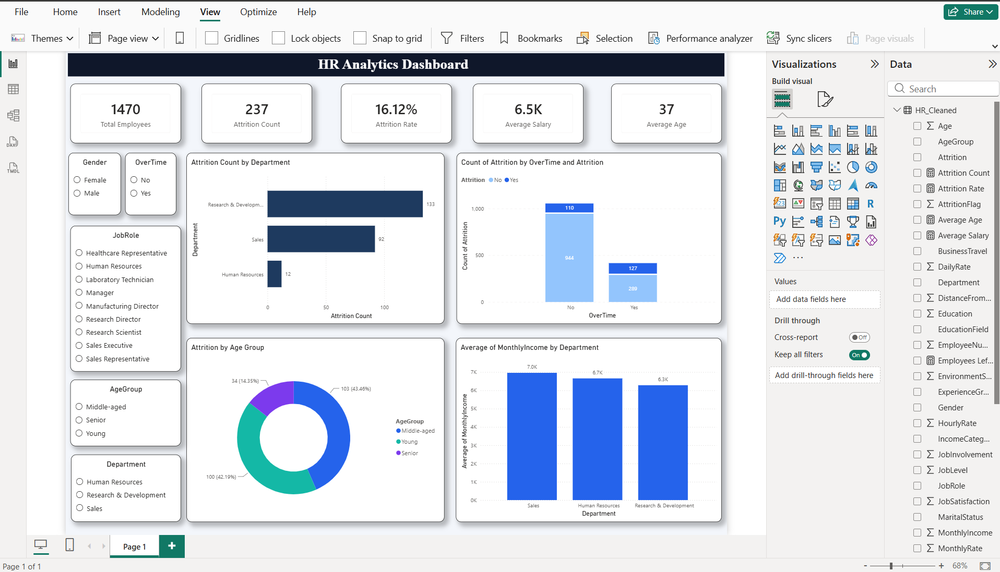

# HR Analytics Dashboard

## 📌 Project Overview

This project analyzes employee attrition and workforce trends using **Python, SQL, and Power BI**. The objective is to identify factors influencing employee turnover and provide interactive insights for HR decision-making.

---

## 🛠️ Tools & Technologies

* **Python** – Pandas, Matplotlib
* **SQL** – MySQL Workbench
* **Power BI** – Dashboard and data visualization

---

## 📂 Project Structure

```text
HR-Analytics-Dashboard/
├── Cleaned_Data/
├── Python/
├── SQL/
├── PowerBI/
├── Images/
└── README.md
```

---

## 📊 Dashboard Features

* KPI Cards

  * Total Employees
  * Attrition Count
  * Attrition Rate
  * Average Salary
  * Average Age

* Visualizations

  * Department-wise Attrition
  * OverTime vs Attrition
  * Attrition by Age Group
  * Average Salary by Department

* Interactive Filters

  * Gender
  * Department
  * Job Role
  * Age Group
  * OverTime

---

## 🔍 Key Insights

* **Research & Development** had the highest attrition (**133 employees**).
* Employees working **OverTime** had a significantly higher attrition rate (**~30.5%**).
* Most employees who left belonged to the **Young** and **Middle-aged** age groups.

---

## 📈 Dashboard Preview

Add your screenshot here:

```md

```

---

## ▶️ How to Run

### Python

Open:

```text
Python/HR_Analytics_EDA.ipynb
```

Run all cells to perform data cleaning and exploratory analysis.

### SQL

Execute:

```text
SQL/HR_Queries.sql
```

in **MySQL Workbench**.

### Power BI

Open:

```text
PowerBI/HR_Analytics_Dashboard.pbix
```

in **Power BI Desktop**.

---

## 🎯 Outcome

This project demonstrates an **end-to-end business analytics workflow** including:

* Data Cleaning
* Exploratory Data Analysis
* SQL Querying
* Data Visualization
* Business Insight Generation
* Interactive Dashboard Development

---

## 👩‍💻 Author

**Menakha Sripriya.C**

Final Year – Artificial Intelligence & Machine Learning
